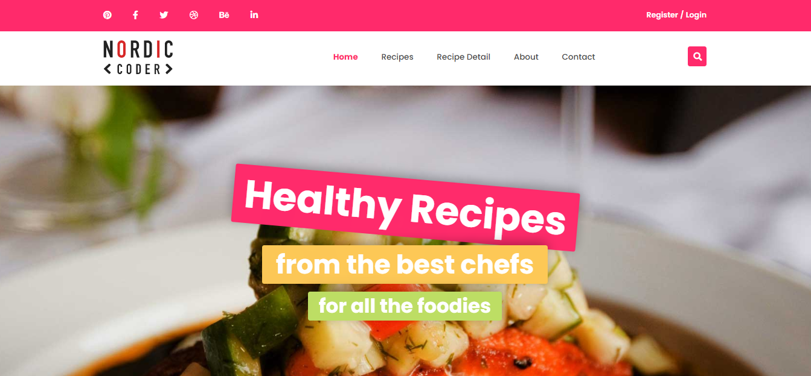

# FOOD BLOG PROJECT

## Description

  
*Food Blog*

## Build with

- `HTML5`
- `CSS3`
- Responsive design using `@media` Media Queries for mobile, tablet, and laptop (not using Bootstrap UI library)
- A little `JavaScript`

## A few other cool features

- Use [AOS animate library](https://github.com/michalsnik/aos) to create transition effects for the website
- Use JavaScript to smooth/slow the scrolling process for the scroll-to-top button
- Use JavaScript to handle the click toggle menu on mobile devices

- How to analyze layout to create HTML Tree, instead of starting coding immediately ---> [Example](markdown/home-html-tree.md)
- How to organize source code directories
- How to arrange the order of CSS properties in groups for easy control and editing later ---> [Read more](https://css-tricks.com/poll-results-how-do-you-order-your-css-properties/)
- The principle is always to separate layout and content when coding the UI
- How to combine flexibility between Bootstrap Grid and Flexbox to have a beautiful UI and clean code
- How to use Git (Version Control System) and GitHub to push source code from the local repository to the remote repository and auto-deploy with [Vercel](https://vercel.com/)
- How to use CSS Properties `transition`, `transform`, and `animation` to create effects for the website
- How to use CSS Variables
- How to use SCSS and auto-compile it to CSS
